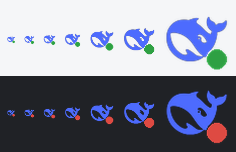

<div align="center">

**English** · [简体中文](README.md)

# Delfin

**A Windows system-tray controller for DeepSeek Harness (`dsh`)**

Service status at a glance, start/stop/restart in one click, with built-in version management and one-click updates.

<sub>Delfin — "dolphin" in German and Spanish. Like the little dolphin in the corner of your taskbar, quietly watching over your dsh.</sub>

[](https://github.com/konmins/delfin/releases)
[](LICENSE)
[](#requirements)
[](#option-2-run-from-source)
[](#disclaimer)



</div>

---

## What is this

[DeepSeek Harness](https://github.com/deepseek-ai/deepseek-harness) (command `dsh`) ships a local web console. But it needs a terminal window kept open around the clock, and when something goes wrong all you have to stare at is a wall of scrolling logs.

Delfin moves all of that into the system tray:

- A **green/red dot** on the dolphin icon — one glance tells you whether the service is alive
- Right-click to **start / stop / restart**, and to open the Web UI
- Built-in **version check and one-click update**, switchable across the `latest` / `next` / `alpha` channels
- **No console window** ever, and nothing added to your taskbar

## Features

| Feature | Description |
| --- | --- |
| Status at a glance | A status dot at the bottom-right of the tray icon: **green = running, red = stopped**. Hovering shows the version and PID |
| One-click control | Start / stop / restart the service; stopping also cleans up the child processes |
| Open Web UI | Pulls the **token-bearing URL** out of the service log before opening your browser (recent `dsh` builds return 401 on a bare URL) |
| Version management | Ships its own locally managed runtime (`runtime/`), so the version is explicit and switchable at will |
| One-click update | Stop the service → download and install → restart automatically, announced by a single balloon |
| Multiple channels | `latest` / `next` / `alpha`; your preference is persisted in `settings.json` |
| Bilingual UI | Chinese and English strings are built in. It **follows your system language** by default and can be switched from the tray menu at any time |
| Silent auto-check | One quiet check 8 seconds after launch. It only speaks up when there is genuinely a new version |
| Single instance | A named mutex keeps it to one tray process, so double-clicking won't breed extra dolphins |
| Crash forensics | Every exception is written to `logs/tray.log`; the polling thread never dies, and the icon is rebuilt automatically if the message loop ever ends unexpectedly |
| Self-test included | `dsh-tray.exe --selftest` verifies the menus, icons and network without opening a GUI |

## Usage

Right-click the tray icon:

> The UI is bilingual. On a non-Chinese Windows the labels below are exactly what you'll see.

| Menu item | Description |
| --- | --- |
| `Status: running  ·  v0.1.5-rc.1` | Read-only status line, showing the current version |
| `Open Web UI (http://127.0.0.1:3080)` | Opens the full token-bearing URL; greyed out while the service is down |
| `Start service` / `Stop service` / `Restart service` | Stop and Restart are greyed out while the service is down, and vice versa |
| `Check for updates` | Queries the `dist-tags` on the npm registry |
| `Update to v0.1.6 (channel latest)` | Only appears when a newer version exists; shows `Up to date (vX)` otherwise |
| `Update channel ▸` | Radio choice of `latest` / `next` / `alpha`; re-checks immediately after you pick one |
| `View update log` | Opens `logs/update.log` (includes the full npm command line) |
| `View service log` | Opens `logs/dsh.log` |
| `语言 / Language ▸`<br>*(Language)* | Radio choice of `简体中文` / `English`; takes effect at once and is saved to `settings.json` |
| `Quit tray` | Closes the tray process only — **the service keeps running** |

> **About the UI language**: on first run it follows your Windows display language (English unless
> the system is Chinese). The language submenu always writes each language **in its own language**,
> so even if auto-detection guesses wrong you can still find the switcher. The
> `语言 / Language` entry itself is deliberately bilingual.

> **Can't find the icon?** Windows files newly appeared tray icons into the "hidden icons" overflow (the `^` arrow on the taskbar).
> Drag the dolphin out of that panel onto the taskbar to pin it permanently.

### Start on boot

Drop a shortcut to `start-tray.vbs` into your Startup folder:

1. Right-click `start-tray.vbs` → Send to → Desktop (create shortcut)
2. Press <kbd>Win</kbd>+<kbd>R</kbd>, type `shell:startup`, press Enter
3. Drag the shortcut in there

`start-tray.vbs` launches through `WScript.Shell.Run(..., 0, False)`, so **no window ever flashes**.

## Quick start

### Option 1: grab the prebuilt exe

Download `dsh-tray.exe` from [Releases](https://github.com/konmins/delfin/releases), drop it anywhere, double-click.
You need **Node.js** installed (it is what runs `dsh`).

### Option 2: run from source

```bat
git clone https://github.com/konmins/delfin.git
cd delfin

pip install -r requirements.txt
python dsh-tray.py
```

To build a single-file exe:

```bat
build.bat
```

which is equivalent to:

```bat
pyinstaller --onefile --noconsole --name dsh-tray ^
  --icon assets\dsh-tray.ico ^
  --hidden-import dsh_icons --hidden-import dsh_update ^
  dsh-tray.py
```

### Requirements

- Windows 10 / 11 (relies on Win32 APIs: named mutex, `taskkill`, `netstat`)
- [Node.js](https://nodejs.org/) 18+ (20 or 22 LTS recommended) — it runs `dsh` itself
- Python 3.9+ (only needed to run from source)
- Default port **3080**, changeable through the `DSH_PORT` environment variable

## Update mechanism

There is a trap here worth explaining. Early versions started the service with
`npx -y @deepseek-ai/dsh web`, and npx **freezes the resolved version into its cache** — once it
resolves to a range such as `^0.1.1-rc.2`, prerelease versions only satisfy the constraint when
`major.minor.patch` match exactly. The result is that it **never upgrades**, and it never tells you.

So the tray now manages its own runtime:

```
runtime/                                  ← created and maintained by the tray
├── package.json                          ← private manifest, dsh version pinned exactly
└── node_modules/@deepseek-ai/dsh/
```

- On startup it prefers the `dsh` inside `runtime\`, and **falls back to `npx` only if absent** (`dsh-runner.cmd`)
- Updates run `npm install @deepseek-ai/dsh@<version> --save-exact`, so the version is hardcoded and unambiguous
- No manual setup: clicking "update to vX" once creates `runtime/` for you

## Project layout

```
delfin/
├── dsh-tray.py           Main program: tray icon, menu, status polling, service control
├── dsh_update.py         Pure logic: semver comparison, registry lookup, runtime install
├── dsh_i18n.py           Chinese/English UI strings + system-language detection
├── dsh_icons.py          Generated icons (base64-embedded so the exe stays self-contained)
├── make_icon.py          Icon generator: shape mask + status dot → dsh_icons.py / .ico / preview.png
├── dsh-runner.cmd        Service launcher, invoked by the tray
├── start-tray.vbs        Launch the tray without a window (recommended)
├── start-tray.bat        Same, as a cmd fallback
├── build.bat             One-command exe build
├── selftest.py           Pure-logic self-test (no GUI): semver / registry / icon decoding
├── dsh-tray.spec         PyInstaller config
├── assets/
│   ├── whale_mask.png    Dolphin shape mask (required to regenerate the icons)
│   ├── dsh-tray.ico      Multi-size exe icon (16–256)
│   └── donate/           Donation QR codes
├── preview.png           Icon preview at multiple sizes (light / dark backgrounds)
└── runtime/              Locally managed dsh runtime (created on first update, not in the repo)
```

## FAQ

**No dolphin in my tray?**
Windows filed it away in the overflow area — see the end of "Usage" above.

**"Open Web UI" won't open, or returns 401?**
Recent `dsh` versions require `?token=…` in the URL. The tray scrapes the last full URL out of
`logs/dsh.log`. If that log has been cleared, click "restart service" first so a fresh URL gets written.

**The update failed — now what?**
Open "view update log". It records the exact npm command and its exit code. The usual culprits are
npm missing from `PATH`, or the registry timing out. You can also just delete the `runtime/`
directory and update again.

**The tray vanished on its own?**
Check `logs/tray.log`. Every uncaught exception, internal pystray error and message-loop rebuild
is recorded there.

**Can I change the port?**
Yes — set the `DSH_PORT` environment variable and restart the tray; both the menu and the
reachability probe follow it.

**Can I change the UI language?**
Yes. Right-click the tray → `语言 / Language` → pick `简体中文` or `English`. It takes effect
immediately and is saved to `settings.json`. The first run picks a language from your Windows
display language (English unless the system is Chinese). You can also force one at launch with
`dsh-tray.exe --lang en` (or `--lang=en`).

## Disclaimer

- This is a **third-party, unofficial tool** with no affiliation with, or endorsement from, DeepSeek.
- The DeepSeek dolphin mark used for the icon is a **trademark of its owner**, used here only to
  indicate "this tray controls dsh". Trademarks are not covered by this repo's MIT license
  (see [`LICENSE`](LICENSE) and the note below).
- The software is provided "as is", without warranty of any kind; the author accepts no liability
  for any consequences of its use.
- This repository **does not contain** `dsh` itself and does not redistribute its binaries; the
  runtime is installed on your own machine through `npm`.

## Support

If this little tool saved you some hassle, you're welcome to buy the author a coffee ☕

<p>
  
  &nbsp;&nbsp;&nbsp;
  
</p>

A ⭐ on the repo works too — it's the cheapest kind of encouragement.

## License

[MIT](LICENSE) © 2026 Konmin

> **About the icons and the trademark**: the shape in `assets/whale_mask.png`, `assets/dsh-tray.ico`,
> `dsh_icons.py` and `preview.png` derives from DeepSeek's official mark, whose trademark rights
> belong to its owner. Those files are included solely to indicate that this project is a companion
> tool for `dsh`, and are **excluded from the MIT grant**. If the rights holder objects, simply swap
> the shape mask and regenerate the icon set with `make_icon.py`.
