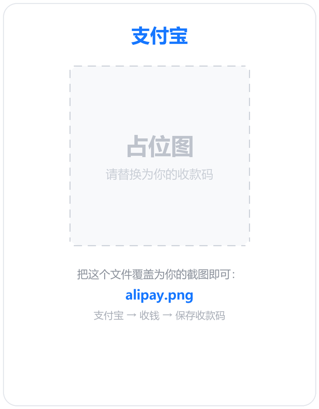

<div align="center">

# dsh-tray

**DeepSeek Harness (`dsh`) 的 Windows 系统托盘控制器**

服务状态一眼可见，启停重启一键完成，内置版本管理与一键更新。

[](LICENSE)
[](#系统要求)
[](#从源码运行)
[](#免责声明)


</div>

---

## 这是什么

[DeepSeek Harness](https://github.com/deepseek-ai/deepseek-harness)（命令 `dsh`）提供了一个本地 Web 控制台。但它需要一直挂着一个终端窗口，出了问题也只能对着滚动的日志发呆。

`dsh-tray` 把这些收进系统托盘：

- 海豚图标右下角一个 **绿点/红点**，扫一眼就知道服务活着没有
- 右键即可 **启动 / 停止 / 重启**，打开 Web 界面
- 内置 **版本检查与一键更新**，还能在 `latest` / `next` / `alpha` 通道之间切换
- 全程 **没有控制台窗口**，也不占用任务栏

## 功能特性

| 特性 | 说明 |
| --- | --- |
| 状态可视化 | 托盘图标右下角状态点：**绿=运行中，红=已停止**；悬停显示版本与 PID |
| 一键控制 | 启动 / 停止 / 重启服务，停止时会连子进程一起收干净 |
| 打开 Web 界面 | 自动从服务日志里取出**带 token 的地址**再打开浏览器（新版本 `dsh` 直连会 401） |
| 版本管理 | 自带本地受管运行时（`runtime/`），版本可控、可随时切换 |
| 一键更新 | 停服务 → 下载安装 → 自动重启，全程只弹一个气泡 |
| 多通道 | `latest` / `next` / `alpha` 三个通道，偏好记在 `settings.json` |
| 自动检查 | 启动 8 秒后静默查一次，只在真有新版时提示，不打扰 |
| 单实例 | 命名互斥体保证只有一个托盘进程，重复双击不会叠出好几只海豚 |
| 崩溃有据 | 所有异常写入 `logs/tray.log`；轮询线程永不退出，消息循环意外结束会自动重建图标 |
| 开箱自检 | `dsh-tray.exe --selftest` 不需要开图形界面就能验证菜单、图标与网络 |

## 使用说明

右键托盘图标：

| 菜单项 | 说明 |
| --- | --- |
| `状态: 运行中 · v0.1.5-rc.1` | 只读状态行，顺带显示当前版本 |
| `打开 Web 界面 (http://127.0.0.1:3080)` | 打开带 token 的完整地址；服务没跑时置灰 |
| `启动服务` / `停止服务` / `重启服务` | 服务未运行时「停止/重启」置灰，反之亦然 |
| `检查更新` | 查询 npm registry 的 `dist-tags` |
| `更新到 v0.1.6（通道 latest）` | 有新版时才出现；已是最新时显示 `已是最新（vX）` |
| `更新通道 ▸` | `latest` / `next` / `alpha` 单选，选择后立即重查 |
| `查看更新日志` | 打开 `logs/update.log`（含完整 npm 命令行） |
| `查看服务日志` | 打开 `logs/dsh.log` |
| `退出托盘` | 只关掉托盘进程，**不会停止服务** |

> **找不到图标？** Windows 默认把新出现的托盘图标收进「隐藏的图标」溢出区（任务栏那个 `^` 箭头）。
> 从溢出面板里把海豚拖到任务栏上即可固定常驻。

### 开机自启

把 `start-tray.vbs` 的快捷方式丢进启动目录：

1. 右键 `start-tray.vbs` → 发送到 → 桌面快捷方式
2. <kbd>Win</kbd>+<kbd>R</kbd> 输入 `shell:startup` 回车
3. 把快捷方式拖进去

`start-tray.vbs` 用 `WScript.Shell.Run(..., 0, False)` 启动，所以**不会闪任何窗口**。

## 快速开始

### 方式一：下载现成的 exe

到 [Releases](https://github.com/YOUR_GITHUB_USERNAME/dsh-tray/releases) 下载 `dsh-tray.exe`，放到任意目录，双击即可。
需要本机已装 **Node.js**（`dsh` 依赖它）。

### 方式二：从源码运行

```bat
git clone https://github.com/YOUR_GITHUB_USERNAME/dsh-tray.git
cd dsh-tray

pip install -r requirements.txt
python dsh-tray.py
```

想打包成单文件 exe：

```bat
build.bat
```

等价于：

```bat
pyinstaller --onefile --noconsole --name dsh-tray ^
  --icon assets\dsh-tray.ico ^
  --hidden-import dsh_icons --hidden-import dsh_update ^
  dsh-tray.py
```

### 系统要求

- Windows 10 / 11（依赖 Win32 API：命名互斥体、`taskkill`、`netstat`）
- [Node.js](https://nodejs.org/) 18+（建议 20 或 22 LTS），`dsh` 本体由它运行
- Python 3.9+（仅源码运行时需要）
- 默认端口 **3080**，可用环境变量 `DSH_PORT` 改

## 更新机制

这里有个坑值得说明。早期版本用 `npx -y @deepseek-ai/dsh web` 启动，而 npx 会把版本**锁进缓存**——
一旦缓存里解析成 `^0.1.1-rc.2` 这类范围，预发布版本只有 `major.minor.patch` 完全相同才满足约束，
结果是**永远不会升级**，还看不出来。

所以现在改成托盘自己管一份运行时：

```
runtime/                                  ← 托盘创建和维护
├── package.json                          ← 私有清单，dependencies 里精确锁定 dsh 版本
└── node_modules/@deepseek-ai/dsh/
```

- 启动时优先用 `runtime\` 里的 `dsh`，**没有才回退到 `npx`**（`dsh-runner.cmd`）
- 更新走 `npm install @deepseek-ai/dsh@<版本> --save-exact`，版本号写死，不留歧义
- 首次使用不需要手动初始化，点一次「更新到 vX」它自己就把 `runtime/` 建好

## 目录结构

```
dsh-tray/
├── dsh-tray.py           主程序：托盘图标、菜单、状态轮询、服务控制
├── dsh_update.py         纯逻辑模块：semver 比较、registry 查询、运行时安装
├── dsh_icons.py          自动生成的图标（base64 内嵌，保证 exe 自包含）
├── make_icon.py          图标生成器：形状遮罩 + 状态点 → dsh_icons.py / .ico / preview.png
├── dsh-runner.cmd        服务启动器，被托盘调用
├── start-tray.vbs        无窗口启动托盘（推荐）
├── start-tray.bat        同上，cmd 备用
├── build.bat             一键打包 exe
├── selftest.py           纯逻辑自检（不含 GUI）：semver / registry / 图标解码
├── dsh-tray.spec         PyInstaller 配置
├── assets/
│   ├── whale_mask.png    海豚形状遮罩（重新生成图标所需）
│   ├── dsh-tray.ico      多尺寸 exe 图标（16~256）
│   └── donate/           赞赏码
├── preview.png           图标多尺寸预览（浅底 / 深底）
└── runtime/              本地受管 dsh 运行时（首次更新时生成，不进版本库）
```

## 常见问题

**托盘里找不到海豚？**
被 Windows 收进溢出区了，见上方「使用说明」末尾。

**「打开 Web 界面」打不开或提示 401？**
新版 `dsh` 要求地址带 `?token=…`。托盘会从 `logs/dsh.log` 里抓最后一条完整地址。
如果日志被清空过，先「重启服务」让新地址落盘。

**更新失败怎么办？**
打开「查看更新日志」，里面记着完整的 npm 命令与返回码。常见原因是 npm 不在 PATH 里，
或网络访问 registry 超时。也可以直接删掉 `runtime/` 目录重新更新一次。

**托盘莫名其妙消失了？**
看 `logs/tray.log`。所有未捕获异常、pystray 内部错误、消息循环重建记录都在里面。

**能改端口吗？**
可以，设置环境变量 `DSH_PORT` 后重启托盘，菜单和探测都会跟着走。

## 免责声明

- 本项目是**第三方非官方工具**，与 DeepSeek 官方无任何隶属或背书关系。
- 图标使用的 DeepSeek 海豚标志是**其权利人的商标**，此处仅用于标识「这个托盘控制的是 dsh」。
  商标不适用本仓库的 MIT 许可（详见 [`LICENSE`](LICENSE) 与下方说明）。
- 程序按「原样」提供，不对因使用造成的任何后果负责。
- 本仓库**不包含** `dsh` 本体，也不随源码分发其二进制；运行时由你的机器通过 `npm` 自行安装。

## 赞赏

如果这个小工具帮到了你，欢迎请作者喝杯咖啡 ☕

<p>
  
  &nbsp;&nbsp;&nbsp;
  
</p>

也可以直接给这个仓库点个 ⭐ —— 那是最不要钱的鼓励。

## 许可

[MIT](LICENSE) © 2026 Konmin

> **关于图标与商标**：`assets/whale_mask.png`、`assets/dsh-tray.ico`、`dsh_icons.py` 与 `preview.png`
> 中包含的形状源自 DeepSeek 的官方标志，其商标权归权利人所有。上述文件仅为表明本项目
> 是 `dsh` 的配套工具而使用，**不包含在 MIT 许可的授权范围内**。若权利人提出异议，可自行
> 用 `make_icon.py` 换掉形状遮罩重新生成一套图标。

---

## English

`dsh-tray` is an unofficial Windows system-tray controller for
[DeepSeek Harness](https://github.com/deepseek-ai/deepseek-harness) (`dsh`).

A green/red dot on the tray icon shows whether the local `dsh web` service is alive;
right-click to start / stop / restart it, open the (token-bearing) Web UI, or check for
and install updates across the `latest` / `next` / `alpha` channels.

Requires Windows 10/11 and Node.js 18+. Licensed under MIT.

Not affiliated with DeepSeek. The DeepSeek logo used for the tray icon is a trademark of
its owner and is excluded from the MIT grant.
